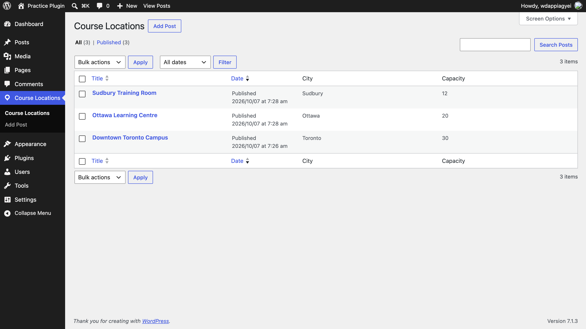
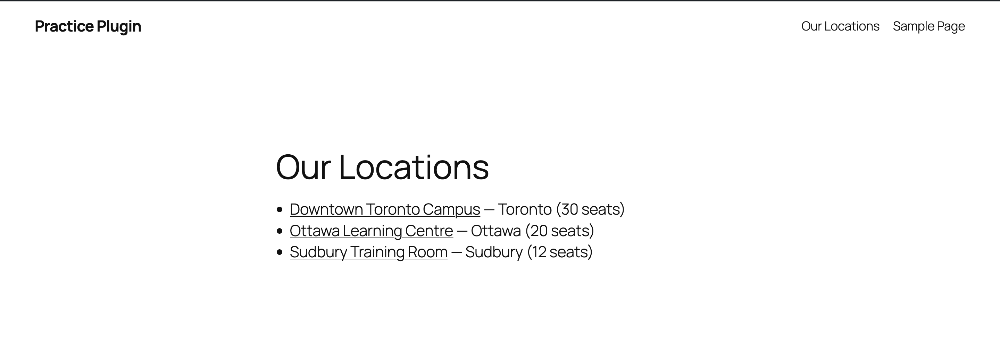

# Course Locations — a WordPress plugin

A learning project covering the four building blocks of custom WordPress development:

| Feature | File | WordPress APIs used |
|---|---|---|
| Custom post type + custom fields | `includes/post-type.php` | `register_post_type`, `register_post_meta`, `add_meta_box`, nonces |
| Shortcode | `includes/shortcode.php` | `add_shortcode`, `shortcode_atts`, `WP_Query` |
| Actions & filters | `includes/hooks.php` | `wp_enqueue_scripts`, `the_content`, admin column hooks |
| Custom REST endpoint | `includes/rest-api.php` | `register_rest_route`, `WP_REST_Request`, `WP_Error` |

## What it does

- Adds a **Course Locations** menu in wp-admin with Address, City and Capacity fields.
- `[course_locations]` shortcode lists locations on any page. Options: `city="Toronto"`, `limit="5"`.
- Single location pages automatically show the address and capacity below the content.
- Admin list shows City and Capacity columns.
- JSON API:
  - `GET /wp-json/course-locations/v1/locations`
  - `GET /wp-json/course-locations/v1/locations?city=Toronto&per_page=5`
  - `GET /wp-json/course-locations/v1/locations/{id}` (returns 404 if not found)

## Install locally

1. Install [LocalWP](https://localwp.com/) (free) and create a new site.
2. Copy this `course-locations` folder into `wp-content/plugins/`.
3. In wp-admin go to **Plugins** and activate **Course Locations**.
4. Go to **Settings → Permalinks** and make sure it's not set to "Plain" (the REST URLs and pretty location URLs need this).

## Try it

1. **Course Locations → Add New**. Create 3 locations with different cities.
2. Create a page containing `[course_locations]` and view it.
3. Change it to `[course_locations city="Toronto"]` and check the filter works.
4. Open `http://your-site.local/wp-json/course-locations/v1/locations` in the browser.
5. Try `/locations/99999` and confirm you get a 404 JSON error.

## Decisions I made

- **Plugin, not theme:** the locations are content. If the code lived in a theme, switching themes would make them disappear from the admin.
- **Prefixed function names (`cl_`):** all WordPress plugins share one global space, so prefixes prevent name clashes with other plugins.
- **Security:** form saves are protected with a nonce and a permission check. Input is sanitized when saved (`sanitize_text_field`, `absint`), and output is escaped when printed (`esc_html`, `esc_attr`, `esc_url`).
- **Rewrite rules flushed only on activation:** this makes location URLs work immediately without slowing down every page load.
- **Custom REST endpoint:** returns only the fields an app needs, in a stable shape, and is versioned (`v1`) so it can change later without breaking existing apps.

## What I'd add next

- A `POST` endpoint to create locations, restricted to logged-in editors.
- A Gutenberg block as an alternative to the shortcode.
- Automated tests with PHPUnit.
